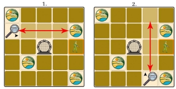
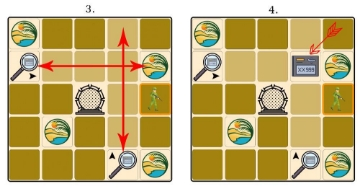
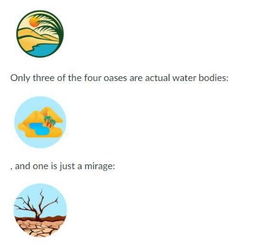
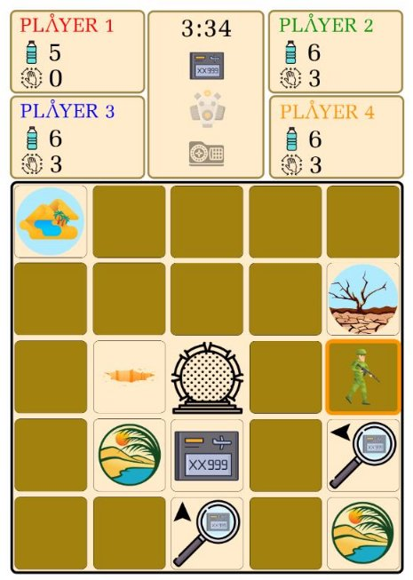

# Stargate-Game

Stargate: The IK-1 team is on a mission 

During the discovery of the planet EIK-235, the scout plane sent through the stargate crashed. General Hammond requested his IK-1 team to locate and repair the aircraft. Due to the lack of data on the plane, there is no information about the planet EIK-235, but the planet may play an essential role in establishing a scientific colony. 

Passing through the stargate, the members of IK-1 arrive on a planet whose surface is 100% desert. The downed plane was found relatively quickly, but upon inspection, the engineers noticed that some parts needed for repair were missing. Help them find the lost parts. 

Description of the game Brief overview 

This is a cooperative game for 1-4 players in which players must find clues and their corresponding parts hidden in the sand on a 5x5 board. Each player has a water bottle containing six units of water, and the players aim to find the parts before someone runs out of water. 

The initial state of the board 

The board is a 5x5-square grid, where four squares show an oasis, and the rest show sand. In addition, the positions of clues and parts are assigned and hidden from the player. 

Traces and parts 

The following components must be found: 

Each part has two traces, which mark the field on which the part is located: one trace marks the column (north-south direction), while the other marks the row (east-west direction). The clues are randomly assigned. 

When the player unearths the first clue space, they determine which row the engine will be in. When the second clue is discovered, the player can choose the exact location of that part. After that, if a player goes to the part's location and uses the Dig action, they have obtained the given part. 

Oases 

There are also four spaces marked as oases on the desert board: 

When a player first uses the Dig action on an oasis, it becomes public whether or not it is a natural body of water. In the case of a water reservoir, the given player's water supply will filled (so it recovers to 6 units of water). In the rest of the game, if the player uses the Dig action on an already discovered water source, the player's water supply will be replenished. 

Gameplay 

A player's turn ends after using three actions. At the end of the round, the given player's water supply decreases by one, and the next player comes. In a one-player game, the player performs the actions one after the other, but in his case, after using three actions, his water decreases by one. 

Actions 

There are the following action types: Move, Dig. The player, in turn, performs the three actions from the action types. You can choose any of them in any order you want. (e.g. he uses 3 Moves in his turn or 2 Moves and 1 Dig...etc) 

Move 

If the player chooses the Move action, he can move to an adjacent square: up, down, left, or right, but never diagonally. 

Digging 

If the player chooses the Dig action, they can "dig up" the space they are standing on, revealing what was hidden under the space. If the player performs the Dig action on a sand field, the following may be below it: 

- **Clue** (3\*2 pieces): This clue concerns where the flying part is. Each component has two clues: one tells you which row it is in and the other which column it is in. After digging it out, you must indicate which part it belongs to and whether the given clue refers to the row or column. 
- **Component** (3 pieces): The component is located at the intersection of the two clues belonging to the given component, which is available if the two clues that belong to it have already been revealed. 
- **Empty Tile** (12 pcs): Empty tiles, so no clues, no parts, no oasis. 

If the player performs the Dig action on an oasis square (4 pieces) with a water reservoir (3 of the four oases) under it, their water resources are replenished. If there is a mirage (1 of the four oases) under the oasis square, it is indicated on the board that such a square is there, and nothing happens to the player's water supply. 

The end of the game 

Victory: If the player(s) find all three parts, they win together. 

Failure: If either player runs out of water or time, you collectively lose the game. 

Playground 

The following things appear on the playing field: 

- 5x5 matrix showing oases, player pieces, and fields revealed during the game 
- Player data: indicating which piece belongs to whom, the amount of water in the water bottle, how many more actions are available in the given round 
- The acquired parts 

Help to solve the task. 

We recommend the same steps to solve the problem as the lecture. 

1. Designing the user interface 
- Create the page with static elements (e.g. HTML and CSS). 
- Pay special attention to the implementation of the square grid! Ensure the elements are square to fit on the page, even on lower-resolution displays. 
- How do you indicate the field elements? With a background colour or a background image?  
- You could use the assets in the following package:[ Assets.zip.](https://canvas.elte.hu/courses/43792/files/2808395/download?wrap=1) 
- Will you have animations? Where, what kind? Get them ready! 
2. Add behaviour 
1. The game logic 
- Data 
  - What data do you need to run the game? 
  - In other words, you should store data that you need to be able to draw the game at any moment! 
  - What data is necessary? And what can you derive or calculate from it? Do not store the latter; always calculate it! 
  - For example, the square grid can be represented by a matrix in which the field elements are stored in the cells. You must also store the items to be drawn, the missions (see above), the elapsed time, and other information. 
- Operations 
  - How do you implement the promotions? 
  - What changes might occur in the game? 
  - What information must you use when implementing actions, such as digging? 
2. The event handlers 
- Which user actions trigger which events? 
- Where can you click in the interface? 
- What should you do then? 
- What data should be read from the interface? 
- And what changes should be made to the data? 
- How do you display the changes? 
  - Do you modify the elements? (imperative) 
  - Or do you replace them and make a redraw? (declarative) 

Of course, you don't have to make these big blocks in one step. You can go step by step. For example: 

1. Draw a square grid 
   1. static prototype (e.g. HTML, CSS) 
   1. matrix at the level of data 
   1. generating an HTML table from a matrix (preparing the declarative direction) 
1. Movement, actions: 
   1. assigning events to actions 
   1. display of game management to the user 
1. Displaying players' data 
   1. static prototype (e.g. HTML, CSS) 
   1. storage of the elements to be placed at the data level 
1. Dividing the game into rounds 
   1. implementation of actions 
   1. switching between players 
1. End of the game 
- when exactly is the game ended (win, lose) 
- managing the results at the end of the game 

Design 

A **good-looking design** is essential. This doesn't necessarily mean making a fancy-looking page, but it does mean ensuring that the layout looks good at 1024x768 resolution and above and that the game board contains square cells. You can use minimalist design, create your own CSS with different background images and graphical elements, or use any CSS framework. 

There are no requirements for which **technology** (table, divs or canvas) you use to solve the task, and there are no strict expectations for the appearance and functionality. The point is that the above functions should be recognizable, and **the game should be playable**. 

Minimal

- Other: The README.md file in the "Additional requirements" section is appropriately filled out and included in the uploaded package
- Game board: The playing field is displayed with a 5x5 board. 
- Game board: Oases appear in a random place on the same board 
- Game board: The player's figure is placed in the centre of the board 
- Movement: The figure can move to one of the adjacent squares. 
- Digging: We can reveal the field element on which the player stands and what is indicated under it. 

Standard requirements 

- Home screen: players have the option to set a name 
- Home screen: setting players' primary water supply 
- Game board: clues are randomly assigned, initially invisible to the players. 
- Game board: player data is displayed 
- Actions: The player can perform three arbitrary actions in the round 
- Actions: It is indicated how many more actions he can perform in his turn 
- Actions: The player's water supply is reduced by one at the end of their turn. 
- Digging: All parts can only be obtained after the two clues have been found. 
- Digging: If the player performs digging in an oasis space, his water supply is replenished. 
- Digging: Only three of the four oases can be filled with water. 
- Game over: If a player runs out of water, it's game over.
- End of the game: If all three parts have been found, the game ends with victory.
- Multiplayer mode: set player number 
- Multiplayer mode: players' figures appear in the middle of the board 
- Multiplayer mode: the current player is indicated  
- Multiplayer mode: actions can only be performed with the current player
- Good-looking appearance 

Extra

- Game area: at the start of the game, start a counter that is updated every second to indicate the elapsed time of the game.  
- Start screen: allow the player(s) to specify how much time they want to complete the game, and after the specified time the game ends 
- Step: the step is animated 
- Saving: The game constantly saves its state in localStorage. When loading a page, if there is such a saved state here, it loads from there, otherwise a new game starts. At the end of the game, the saved state is deleted.  
